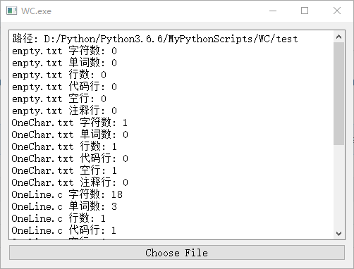

# WC.exe
```
WC.exe
You can star this repository to count the number of characters, words, lines, blank lines, lines of code, comment lines of text files.
```

## Support
- [x] [character]
- [x] [word]
- [x] [line]
- [x] [code line]
- [x] [blank line]
- [x] [comment line] 
- [x] [GUI]

## Usage
#### Returns the number of characters in file. C
```
$ python wc.py -c "C:/file.c"
```

#### Returns the number of words in file. C
```
$ python wc.py -w "C:/file.c"
```

#### Returns the number of lines in file. C
```
$ python wc.py -l "C:/file.c"
```

#### Return more complex data (code line/blank line/comment line)
```
$ python wc.py -a "C:/file.c"
```

#### Recursively processes qualified files in the directory
```
$ python wc.py -c -w -l -a -s "C:/*.c"
```

#### Display graphical interface
```
$ python wc.py -x " "
```

## Environment
* Windows
* Python 3.6.6

## Running Screenshot


[others image](./image)